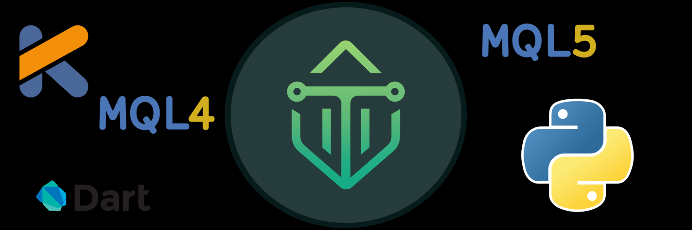

# TuyulTronik

- 🔭 I’m currently working on **<ins>FLUTTER</ins>**
- 🌱 I’m currently learning  
   *    **<ins>MQL4<ins>**
   * **<ins>MQL5<ins>** 
   * **<ins>Python<ins>**
   * **<ins>Kotlin<ins>**
<!--
###

###
 
 

 ###

>